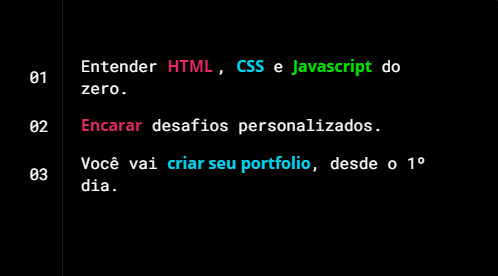
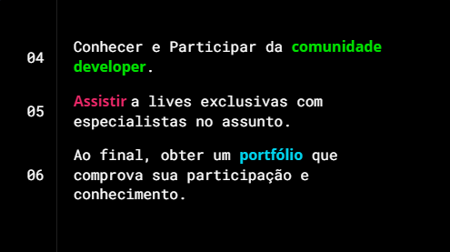

<h3 align="center">
  📈 Tabela de claaificacao 📈
</h3>

<blockquote align="center">“Tabela de classificaçao para jogos ou competiçoes🖱️”</blockquote>

## 💡 Funcionalidades

- Marcar vitorias, empates e derrotas.
- Somando pontuaçao vitorias(3pts), empates(1pts), derrotas(0pts).

 

## :rocket: Tecnologias:

Esse projeto foi desenvolvido com as seguintes tecnologias:

- [HTML][html]
- [CSS][css]
- [Java][js]

## 🎫 O que é a Imersão DEV?

Um evento com 10 aulas gratuitas e desafios práticos para dar os primeiros passos na área de programação e criar seus primeiros códigos,
 Você vai aprender com quem domina o assunto e terá todo apoio da nossa equipe e comunidade durante o projeto.
 

* Aulas todos os dias.

* desafios, porque o melhor aprendizado é na prática.

* Especialistas em programação e com a qualidade da maior escola de tecnologia online do Brasil.

* São 10 aulas gratuitas para aprender a criar seus primeiros códigos e começar sua carreira em programação.

## 🎫 O que você vai aprender??

## 🔗 Criado em CodePen 

Projeto feito na semana Imersão DEV da Alura. 🏆 [Saiba mais!](https://imersao.dev/)
 
------
Copyright (c) 2021 by Amadeu Filipe Lopes (https://codepen.io/felipelopes12/pen/rNjWrJG)

[html]: https://developer.mozilla.org/pt-BR/docs/Web/HTML
[css]: https://developer.mozilla.org/pt-BR/docs/Web/CSS
[js]: https://developer.mozilla.org/pt-BR/docs/Web/JavaScript

