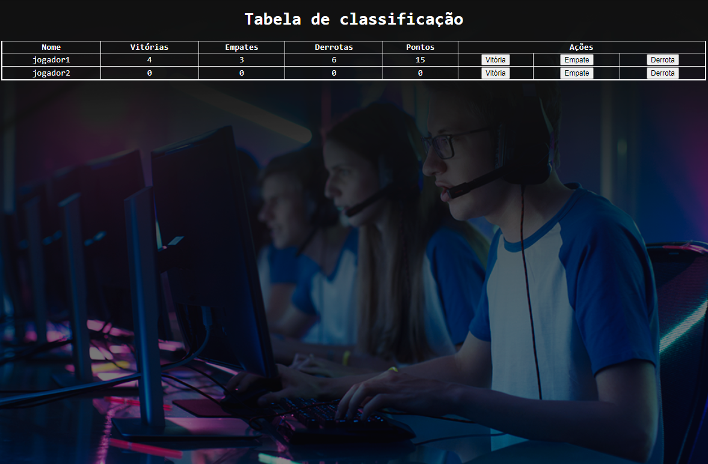

## 💻 Projeto
Tabela de classificaçao para jogos ou competiçoes.🖱️

## 💡 Funcionalidades

- Marcar vitorias, empates e derrotas.
- Somando pontuaçao vitorias(3pts), empates(1pts), derrotas(0pts).

 
## 🔗 Criada em CodePen.io. 
 URL original: https://codepen.io/felipelopes12/pen/rNjWrJG .